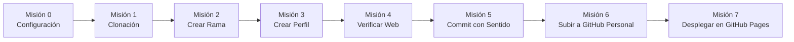

# 📘 Guía Paso a Paso: Taller de Git y GitHub

Esta guía contiene la secuencia detallada de misiones que debes completar. Sigue cada paso en orden desde tu terminal (Git Bash, PowerShell o la terminal integrada de VS Code).

---

## 🎯 Mapa de Misiones del Aprendiz



---

## 🛠️ Misión 0: Configurar tu Identidad en Git (Solo una vez)

Antes de realizar cualquier commit, Git necesita saber quién eres. Abre tu terminal y ejecuta:

```bash
# 1. Configura tu nombre completo
git config --global user.name "Tu Nombre y Apellido"

# 2. Configura tu correo electrónico (el mismo de tu cuenta de GitHub)
git config --global user.email "tu-correo@soy.sena.edu.co"

# 3. Comprueba que quedaron guardados correctamente
git config --list
```

---

## 📥 Misión 1: Clonar el Repositorio

El instructor te proporcionará la URL del repositorio base del taller. Descárgalo en tu computadora:

```bash
# 1. Clona el repositorio
git clone <URL_DEL_REPOSITORIO_DEL_INSTRUCTOR>

# 2. Entra a la carpeta del proyecto
cd taller-git-github

# 3. Comprueba el estado inicial
git status
```

---

## 🌿 Misión 2: Crear tu Propia Rama de Trabajo (`Feature Branch`)

> **Regla de oro del desarrollador:** Nunca trabajes directamente sobre la rama `main` o `master`. Siempre crea una rama específica para tu cambio.

Crea y muévete a tu nueva rama utilizando tu nombre y apellido:

```bash
# Formato: perfil/primer-nombre-primer-apellido (todo en minúsculas y sin tildes ni espacios)
git checkout -b perfil/juan-perez

# Comprueba que estás ubicado en tu nueva rama (aparecerá con un asterisco *)
git branch
```

---

## ✍️ Misión 3: Crear tu Perfil de Desarrollador

Tienes dos formas de realizar esta misión:

### Opción A (Visual - Recomendada):
1. Abre el archivo `index.html` en tu navegador.
2. Haz clic en el botón verde **"Agregar mi Perfil"** o **"Generar mi Tarjeta de Perfil"**.
3. Llena el formulario interactivo con tus datos reales.
4. Haz clic en **"Descargar .json"** y guárdalo dentro de la carpeta `perfiles/` con el nombre `tu-nombre-apellido.json` (ejemplo: `perfiles/juan-perez.json`).
5. Abre el archivo `js/aprendices_db.js` en tu editor de código y pega tu objeto de datos dentro del arreglo `APRENDICES_DATA` para que se renderice automáticamente al abrir la página.

### Opción B (Manual):
1. Ve a la carpeta `perfiles/`.
2. Duplica el archivo `_plantilla_perfil.json`.
3. Renombra la copia como `tu-nombre-apellido.json` (ejemplo: `juan-perez.json`).
4. Abre el archivo en VS Code y edita tus datos (nombre, ficha, habilidades, redes).
5. Abre `js/aprendices_db.js` y agrega tus datos al arreglo `APRENDICES_DATA`.

---

## 🔍 Misión 4: Verificación Local

1. Abre `index.html` en tu navegador (o usa la extensión *Live Server* en VS Code).
2. Verifica que tu tarjeta aparezca en la galería.
3. Prueba el buscador con tu nombre o con alguna de tus habilidades para asegurarte de que los filtros funcionan correctamente.
4. Haz clic sobre tu tarjeta para abrir el modal y revisar que tu información se vea impecable.

---

## 💾 Misión 5: Registrar tus Cambios con Buenas Prácticas (`Commit`)

Revisa qué archivos has modificado o creado:

```bash
# 1. Verifica los archivos modificados
git status

# 2. Agrega los cambios al área de preparación (Staging Area)
git add perfiles/juan-perez.json js/aprendices_db.js

# Si también agregaste un avatar personalizado en assets/avatares:
git add assets/avatares/

# 3. Realiza el commit con un mensaje estructurado (Conventional Commits)
git commit -m "feat(perfil): agregar perfil profesional de Juan Perez"

# 4. Verifica el historial para confirmar que tu commit fue registrado
git log --oneline -n 3
```

---

## 🚀 Misión 6: Publicar el Proyecto en tu Cuenta Personal de GitHub

Cada aprendiz tendrá su propia copia pública del proyecto en su cuenta de GitHub.

### Paso 6.1: Crear el repositorio vacío en GitHub
1. Ingresa a tu cuenta en [https://github.com](https://github.com).
2. Haz clic en el botón verde **"New"** (Nuevo Repositorio).
3. Nombra tu repositorio: `directorio-aprendices-sena` o `mi-perfil-sena`.
4. Selecciónalo como **Público**.
5. **IMPORTANTE:** **NO** marques las casillas de "Add a README file", ".gitignore" ni "License" (debe crearse completamente vacío).
6. Haz clic en **"Create repository"** y copia la URL HTTPS de tu nuevo repositorio (ejemplo: `https://github.com/tu-usuario/directorio-aprendices-sena.git`).

### Paso 6.2: Fusionar tu rama a main y subir a tu repositorio
Regresa a tu terminal y ejecuta:

```bash
# 1. Pásate a la rama principal (main)
git checkout main

# 2. Fusiona los cambios de tu rama de perfil
git merge perfil/juan-perez -m "merge: integrar perfil de Juan Perez a rama principal"

# 3. Cambia la URL del repositorio remoto hacia TU cuenta personal de GitHub
git remote set-url origin https://github.com/TU-USUARIO/directorio-aprendices-sena.git

# 4. Verifica que el remoto ahora apunte a tu cuenta de GitHub
git remote -v

# 5. Sube tu rama principal y tu rama de trabajo a GitHub
git push -u origin main
git push -u origin perfil/juan-perez
```

---

## 🌐 Misión 7: Desplegar tu Sitio Web con GitHub Pages

Para que cualquier persona (y tu instructor) pueda ver tu proyecto funcionando en internet:

1. En la página de tu repositorio en GitHub, ve a la pestaña **Settings** (Configuración ⚙️).
2. En el menú lateral izquierdo, haz clic en **Pages**.
3. En la sección **Build and deployment > Branch**:
   - Selecciona la rama: **`main`**
   - Selecciona la carpeta: **`/(root)`**
4. Haz clic en **Save** (Guardar).
5. Espera entre 1 y 2 minutos y recarga la página. Verás un mensaje en verde con tu enlace público:
   `https://TU-USUARIO.github.io/directorio-aprendices-sena/`g

---

## 📤 Misión 8: Entrega de Evidencia al Instructor

Envía por la plataforma Moodle / Territorium o el canal designado por tu instructor los siguientes dos enlaces:

1. 🔗 **URL del Repositorio en GitHub:** `https://github.com/TU-USUARIO/directorio-aprendices-sena`
2. 🌐 **URL de la Web en Vivo (GitHub Pages):** `https://TU-USUARIO.github.io/directorio-aprendices-sena/`

---

¡Felicitaciones! Has completado el ciclo profesional de desarrollo colaborativo con Git y GitHub. 🎉
